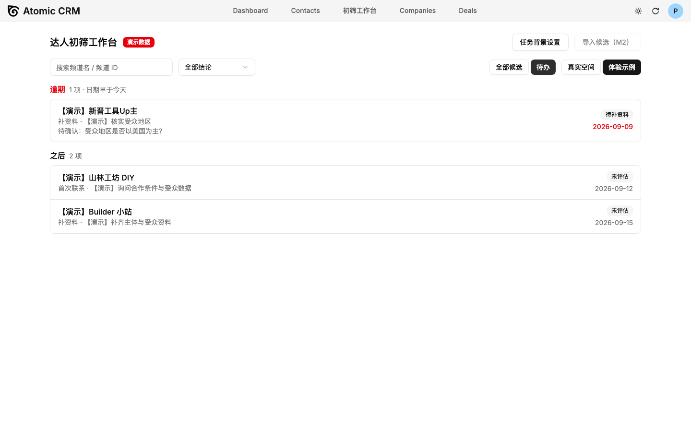
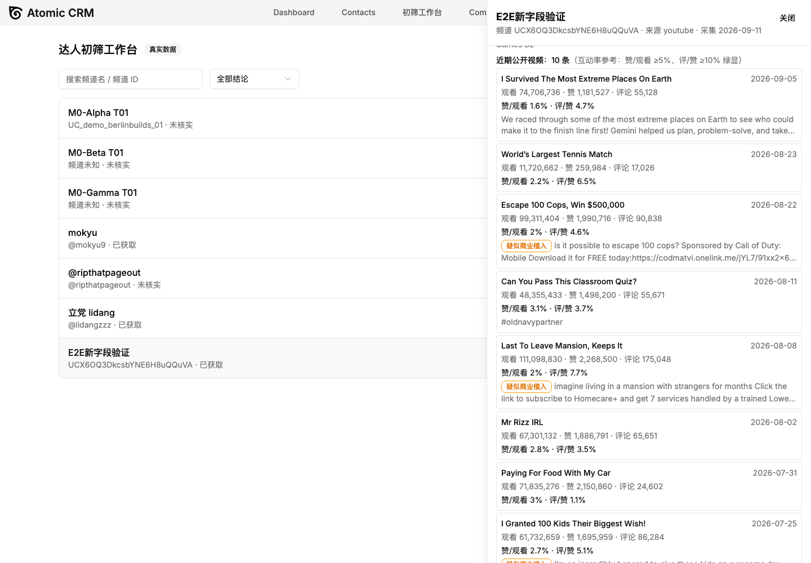

# YouTube 达人初筛助手 / YouTube Creator Screening Assistant

**中文** | [English](#english)

> 把分散的达人候选资料、人工判断和下一步行动连成闭环的本地工作台。
> A local workbench that connects scattered creator profiles, human judgment, and next actions into one closed loop.

源自一段工具出海品牌的达人营销实习：维护 9 位达人、34 字段的资源表时，在频道页、资料和表格之间反复切换，判断依据散落备注，筛完还要手工重组联系名单。这个工具把「导入候选 → 自动整理资料 → 人工初筛 → 下一步任务 → 导出名单」做成了一个可验证的闭环。

Born from an influencer-marketing internship at a tools/DTC brand: while maintaining a 9-creator, 34-column prospect sheet, work meant constant switching between channel pages, data sources, and spreadsheets, with judgment rationale scattered across notes. This tool turns "import candidates → auto-organize profiles → manual screening → next-step tasks → export list" into one verifiable loop.

| 待办视图 Todo | 资料与互动率 Profiles & Engagement |
| --- | --- |
|  |  |

---

## 中文

### 功能特性

- **导入与排重**：粘贴 UC 频道 ID / @handle / 频道链接，自动归一化（视频链接、短链、旧 `/c/` `/user/` 路径明确报不支持）；逐行预检（新增/已存在/重复/无效互斥计数）；20 行 / 1MB 上限；Nox/Modash 等工具导出 CSV 自动识别列名，结论作为**来源备注**保存（不污染原始数据）
- **资料自动获取**：YouTube Data API v3（Key 只在服务端，不进浏览器/日志/CSV）；频道资料 + 最近 10 条视频（观看/点赞/评论原始值、总播放量、视频总数、描述）；**互动率自动计算**（赞/观看 ≥5%、评/赞 ≥10% 绿显，阈值来自实习 SOP）；**疑似商业植入徽章**（扫描描述中的赞助关键词，竞品史排查用）
- **人工初筛**：五项业务检查（场景适配/主体性质/受众依据/量级/品类经验，允许「未知」不强行补值）；按结论的必填校验（优先联系必须含场景证据+下一步动作，暂缓自动取消任务）；评估版本追加式保存 + 草稿分离；内容不变重复保存不产生新版本
- **待办与提醒**：逾期/今天/之后分组（Asia/Shanghai 自然日，今天不算逾期）；频控提醒（累计发信 5 次或距最近发信不足 168 小时），可在设置中关闭
- **建联跟踪**：记录已联系/已回复（补录过去时间，未来时间服务端拒绝）、撤销重算、停止联系（原因必填，自动取消联系类任务，期间仍可补录历史事实）
- **导出**：17 字段 CSV（UTF-8 BOM、公式字符防护、来源备注）；两种范围——可行动名单（结论为优先联系/待补资料 + 有 open 任务 + 未停止联系 + 非待复核）与当前筛选结果；示例空间导出自动加 `DEMO` 标记
- **双空间隔离**：真实空间与示例空间（10 位合成候选，覆盖受众未知/统计缺失/已停止联系等场景）数据完全隔离，演示全程显著标注

### 快速开始

前置要求：Node 22+（26 实测可用）、Docker、[Supabase CLI](https://supabase.com/docs/guides/cli)。

```bash
# 1. 安装依赖
npm install

# 2. 启动本地 Supabase（数据库/认证，数据存 volume 重启不丢）
npx supabase start

# 3. 启动前端
npm run dev

# 4. 启动资料获取函数（独立进程）
npx supabase functions serve --env-file supabase/functions/.env
```

打开 `http://localhost:5173/#/candidates`。首次使用在登录页注册本地账号；点「体验示例」即刻查看 10 位合成候选的完整演示（无需 API Key）。

**配置 YouTube API Key**（真实资料获取需要，免费额度每天 10,000 单位、每位候选约 3 单位）：

1. [Google Cloud Console](https://console.cloud.google.com) → 启用 YouTube Data API v3 → 创建 API 密钥
2. 写入 `supabase/functions/.env`（已被 gitignore，不会进仓库）：

```ini
YOUTUBE_API_KEY=你的Key
SB_JWT_ISSUER=http://127.0.0.1:54321/auth/v1
# 若你的网络访问 googleapis.com 需要代理，函数容器同样需要：
HTTPS_PROXY=http://host.docker.internal:7890
NO_PROXY=kong,localhost,127.0.0.1,host.docker.internal
```

### 验证与测试

```bash
npm run typecheck && npm run lint        # 类型与 lint
npx vitest run --project app             # 单元 + 组件测试（183 项）
npx vitest run --project functions       # Edge Function 测试
node scripts/verify-t13-t14.mjs          # 端到端回归（18 项断言，可重复执行）
node scripts/verify-m2.mjs               # 导入/获取/导出 E2E（8 项）
node scripts/verify-m3.mjs               # 建联/停止联系 E2E（11 项）
node scripts/verify-a20.mjs              # 删除候选 E2E（5 项）
node scripts/benchmark-tool.mjs          # 提效基准（10 位候选闭环实测）
```

PRD 的 A01—A20 验收用例逐项记录在 [`docs/acceptance.csv`](docs/acceptance.csv)（当前 15/20 通过，其余为后续范围或待真实频道验收）；提效模拟对照见 [`docs/BENCHMARK.md`](docs/BENCHMARK.md)。设计决策与取舍记录在 [`docs/DECISIONS.md`](docs/DECISIONS.md)。

### 架构与复用

- **底座**：[Atomic CRM](https://github.com/marmelab/atomic-crm)（React 19 + Vite + Supabase/Postgres，MIT）——经验证后复用其列表/表单/任务/认证/数据访问（约 4 万行），不重复造轮子；上游完整功能见[原版 README](https://github.com/marmelab/atomic-crm#readme)
- **自研**：约 5 千行领域代码——workspace 双空间、评估版本化与按结论校验、频道归一化导入、服务端资料获取、待办/提醒/建联、17 字段导出，及全套可复跑的验证脚本
- 关键工程约束：业务主键与唯一约束在数据库层执行（不只靠前端禁用）；未知不补 0、频道国家不冒充受众国家；服务失败保留用户输入

### 已知限制

- 真实 YouTube Key 的 10 频道验收（A02）待执行；未配 Key 时导入的候选显示「未核实」
- 不做自动评分、自动发信、邮箱爬取、全网发现——范围决策见 PRD 与 DECISIONS
- Edge Function 本地运行需独立进程；国内网络需为函数容器配置代理（见上）

### License

MIT（继承上游 [marmelab/atomic-crm](https://github.com/marmelab/atomic-crm)）。本项目为个人产品实践，**AI 辅助开发**——需求取舍、规则口径、验收标准与最终解释由本人负责，实现由 AI 协作完成并以上述脚本逐项验证。

---

## English

### Features

- **Import & dedup**: paste channel IDs / @handles / URLs with automatic normalization (video links, short links, legacy paths are explicitly rejected with reasons); per-line pre-check with mutually exclusive counts (new / exists / duplicate / invalid); 20-row / 1MB limits; auto-detects columns from Nox/Modash-style export CSVs and stores conclusions as **traceable source notes** (never mixed into raw data)
- **Profile fetching**: YouTube Data API v3 with the key kept server-side only; channel profile + latest 10 videos (raw views/likes/comments, channel total views, video count, descriptions); **auto-computed engagement rates** (like/view ≥5%, comment/like ≥10% highlighted green — thresholds from the internship SOP); **suspected-sponsorship badges** scanned from video descriptions for competitor-history checks
- **Manual screening**: five business checks (scene fit / entity / audience evidence / scale / category experience, each allowing "unknown" — never forced into a value); per-decision validation (priority_contact requires scene evidence + next action; paused auto-cancels open tasks); append-only assessment versioning with separate drafts; identical re-saves create no new version
- **Todo & reminders**: overdue / today / later groups (Asia/Shanghai calendar days); frequency-capping reminders (5 total sends or <168h since last), toggleable in settings
- **Outreach tracking**: log sent/replied (backdating allowed, future times rejected server-side), void & recompute, do-not-contact (reason required, auto-cancels outreach tasks, historical facts can still be backfilled)
- **Export**: 17-field CSV (UTF-8 BOM, formula-injection protection, source notes); two scopes — actionable list (priority_contact / needs_info + open task + not DNC + not review-stale) or current filter; demo-space exports carry a `DEMO` marker
- **Workspace isolation**: real workspace vs demo workspace (10 synthetic candidates covering unknown-audience / missing-stats / DNC scenarios), clearly labeled at all times

### Quick Start

Prerequisites: Node 22+, Docker, [Supabase CLI](https://supabase.com/docs/guides/cli).

```bash
npm install
npx supabase start        # local database & auth
npm run dev               # frontend on :5173
npx supabase functions serve --env-file supabase/functions/.env   # fetch function
```

Open `http://localhost:5173/#/candidates`, register a local account, and click "体验示例" for an instant demo with 10 synthetic candidates (no API key needed).

**YouTube API key** (for real profile fetching; free tier = 10,000 units/day, ~3 units per candidate): enable YouTube Data API v3 in Google Cloud Console, create an API key, and put it in `supabase/functions/.env` (gitignored) as shown in the Chinese section above — including the proxy variables if your network needs them to reach googleapis.com.

### Verification

Type check / lint / 183 unit & component tests / Edge Function tests, plus re-runnable E2E scripts (18 + 8 + 11 + 5 assertions) — see the commands in the Chinese section. All 20 PRD acceptance cases are tracked row-by-row in [`docs/acceptance.csv`](docs/acceptance.csv) (15 passed; the rest are scoped-out follow-ups or pending real-key acceptance). The simulated efficiency benchmark lives in [`docs/BENCHMARK.md`](docs/BENCHMARK.md); design decisions in [`docs/DECISIONS.md`](docs/DECISIONS.md).

### Architecture & Reuse

Built on [Atomic CRM](https://github.com/marmelab/atomic-crm) (React 19 + Vite + Supabase/Postgres, MIT) — validated first, then reused for lists/forms/tasks/auth/data access (~40k lines), avoiding reinvention. ~5k lines of domain-specific code added: dual workspaces, append-only assessments with per-decision validation, channel-normalizing import, server-side profile fetching, todo/reminders/outreach, 17-field export, and the full verification suite. Hard constraints: uniqueness enforced at the database level, unknown ≠ 0, channel country never presented as audience country, user input preserved on server failures.

### Known Limitations

- Real-key acceptance on 10 live channels (A02) pending
- No auto-scoring, auto-outreach, email scraping, or discovery — deliberate scope decisions (see PRD & DECISIONS)
- The Edge Function runs as a separate local process; networks that proxy googleapis.com need the container proxy variables above

### License

MIT (inherited from upstream [marmelab/atomic-crm](https://github.com/marmelab/atomic-crm)). A personal product practice project **built with AI assistance** — scope decisions, business rules, acceptance criteria, and final interpretation are the author's; implementation was AI-collaborative and verified by the scripts above.
